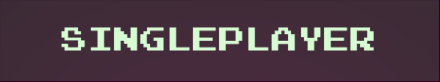
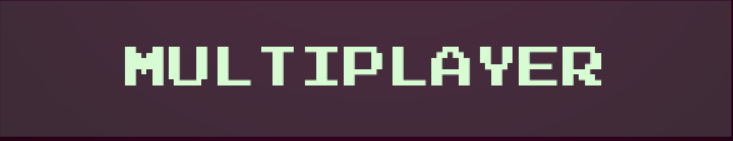
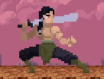

  

  <strong>Welcome to Martial Mayhem, the online multiplayer fighting game made with pygame.</strong>

  

# Getting Started

Go to your favourite terminal, clone the repository, then:

    pip3 -m install requirements.txt
    python3 main.py
    
### To Download the game

Do the above, then:

    -> in main.spec, change the path in line 9 to the path where your python packages are located
    -> be sure to use double backslashes
    -> in the terminal where main.spec is located
    pyinstaller main.spec

# How To Play

- Select your Fighter and the map
- Win rounds by attacking the opponent until their health bar is depleted
- First fighter to win 3 rounds wins the game!

# Game Modes

  
  <strong>Battle against the computer in an intense one on one match!</strong>

  
  <strong>Play your friend locally using the same keyboard!</strong>

  
  <strong>Queue up for an intense match online!</strong>

We use a server provided by NetSoc, which can host up to 10 simultaneous games.

# Controls

## Player 1
    W - jump
    A - move left
    S - block
    D - move right

    R - light attack
    T - heavy attack

## Player 2
    up arrow - jump
    left arrow - move left
    down arrow - block
    right arrow - move right

    N - light attack
    M - heavy attack

# Characters

## Wizard

  

A zoner with powerful ranged attacks, stay away and poke the enemy from range!

    light attack - quick spammable projectile with small damage and knockback
    heavy attack - a large slow projectile with massive damage and knockback

## Warrior

  

A bruiser with ppowerful melee attacks, don't let him get close!

    light attack - quick sword swing good for staggering the opponent
    heavy attack - heavy sword swing which does devastating damage

## Nomad

  

A specialist of all fighting styles, dangerous at any range!

    light attack - a quick and deadly sword swing with short range
    heavy attack - a projectile with big knockback on hit

# Credits

Check out the [Credits](CREDITS.md) page and show some love to the artists who let us use their tile sets.

# Contributing

Feel free to join the [Discord channel](https://discord.gg/rrVNskkC) if you want to contribute!

